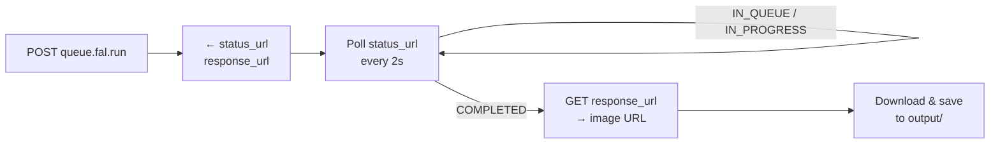
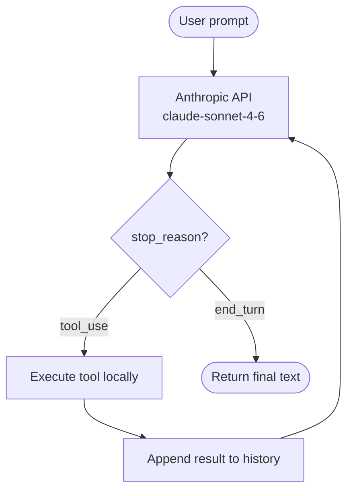
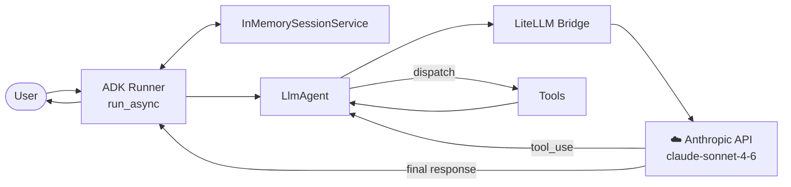
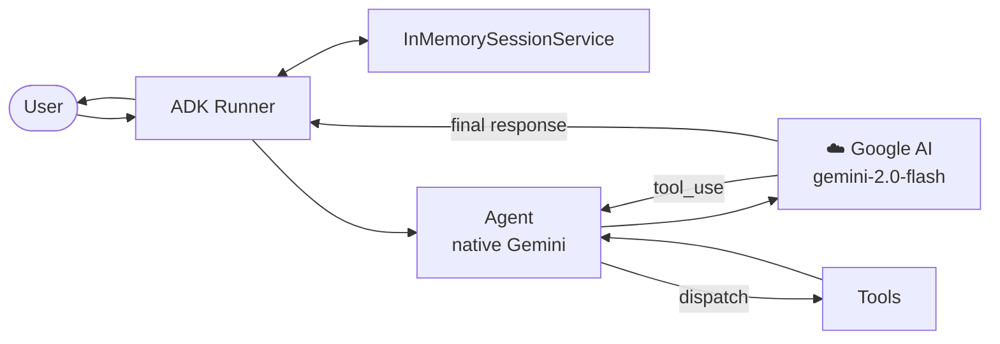
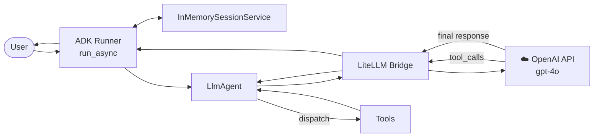
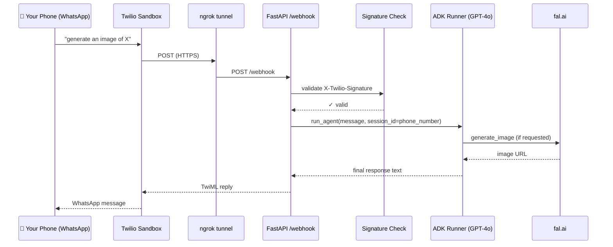

# Repository Architecture

A collection of AI agents that generate images, save files, and read files — implemented at different abstraction levels for comparison, with a WhatsApp interface for sending instructions from your phone.

---

## Contents

- [Repository Overview](#repository-overview)
- [Shared Tools](#shared-tools)
- [fal.ai Queue Pattern](#falai-queue-pattern)
- [Agents](#agents)
  - [Tier 1 — agent\_guide (raw Anthropic API)](#tier-1--agent_guide)
  - [Tier 2 — agent\_adk (ADK + Claude)](#tier-2--agent_adk)
  - [Tier 2 — agent\_adk\_gemini (ADK + Gemini)](#tier-2--agent_adk_gemini)
  - [Tier 2 — agent\_adk\_openai (ADK + GPT-4o)](#tier-2--agent_adk_openai)
- [WhatsApp Interface — whatsapp\_twilio](#whatsapp-interface--whatsapp_twilio)
- [Agent Comparison](#agent-comparison)
- [Folder Structure](#folder-structure)
- [Environment Variables](#environment-variables)
- [Install & Run](#install--run)

---

## Repository Overview

The same creative assistant is built **four ways**, showing how the same capability can be expressed at different abstraction levels. A fifth component adds a **WhatsApp interface** on top of the most capable CLI agent.

| Component | Layer | Description |
|---|---|---|
| `agent_guide` | Tier 1 · Raw API | Manual agentic loop over the Anthropic API. No framework. Maximum visibility into how tool-use works. |
| `agent_adk` | Tier 2 · Google ADK | Same tools, Claude Sonnet 4.6 via LiteLLM bridge. ADK drives the loop automatically. |
| `agent_adk_gemini` | Tier 2 · Google ADK | ADK's native Gemini 2.0 Flash path — no LiteLLM needed. |
| `agent_adk_openai` | Tier 2 · Google ADK | GPT-4o via LiteLLM bridge. Structurally identical to agent_adk. |
| `whatsapp_twilio` | Interface layer | FastAPI webhook wrapping agent_adk_openai. Send instructions from WhatsApp via Twilio sandbox. |

---

## Shared Tools

All four agents expose the same three tools. The only difference is how schemas are registered — hand-authored JSON in Tier 1, automatic function introspection in Tier 2.

| Tool | Signature | What it does | Returns |
|---|---|---|---|
| `generate_image` | `(prompt: str, filename: str) → dict` | Submits a job to the fal.ai Flux Schnell async queue, polls until `COMPLETED`, downloads and saves the image to `output/` | `{status, filename, url, prompt_used}` |
| `save_file` | `(filename: str, content: str) → dict` | Writes UTF-8 text to disk via `pathlib.Path.write_text()` | `{status, filename, bytes_written}` |
| `read_file` | `(filename: str) → dict` | Reads UTF-8 text from disk; returns a descriptive error dict if the file is missing | `{status, filename, content}` |

---

## fal.ai Queue Pattern

`queue.fal.run` is **asynchronous** — the initial POST returns a job handle, not the image. All agents implement the same three-step polling loop:



> **Common pitfall:** treating the initial POST response as the image result. It is only a queue ticket. Always poll `status_url` until `status == "COMPLETED"` before fetching `response_url`.

---

## Agents

### Tier 1 — agent_guide

> **Framework:** Raw Anthropic API &nbsp;|&nbsp; **Model:** Claude Sonnet 4.6

The reference implementation. No framework — every step of the agentic loop is written by hand. Best for understanding exactly how tool-use works at the API level.



**Key details:**
- Tool schemas are hand-authored JSON in the `TOOLS` list
- `TOOL_HANDLERS` dict maps tool name strings to Python callables
- Safety cap: max 10 iterations to prevent runaway loops
- Conversation history built and managed manually as a Python list

📄 [agent_guide.py](image_generation_agent/agent_guide/agent_guide.py)

---

### Tier 2 — agent_adk

> **Framework:** Google ADK &nbsp;|&nbsp; **Model:** Claude Sonnet 4.6 &nbsp;|&nbsp; **Bridge:** LiteLLM

Same tools, same behaviour. ADK's `Runner` replaces the manual loop. Claude is accessed via the **LiteLLM bridge** — ADK speaks Gemini natively; LiteLLM translates to the Anthropic API format.



📄 [agent_adk.py](image_generation_agent/agent_adk/agent_adk.py) · [architecture.md](image_generation_agent/agent_adk/architecture.md)

---

### Tier 2 — agent_adk_gemini

> **Framework:** Google ADK &nbsp;|&nbsp; **Model:** Gemini 2.0 Flash &nbsp;|&nbsp; **Bridge:** None (native)

ADK's native path — no LiteLLM required. ADK was built for Gemini, so this is the simplest Tier 2 variant. Uses `google.adk.agents.Agent` (not `LlmAgent`) and Gemini 2.0 Flash directly.



📄 [agent_adk_gemini.py](image_generation_agent/agent_adk_gemini/agent_adk_gemini.py) · [architecture.md](image_generation_agent/agent_adk_gemini/architecture.md)

---

### Tier 2 — agent_adk_openai

> **Framework:** Google ADK &nbsp;|&nbsp; **Model:** GPT-4o &nbsp;|&nbsp; **Bridge:** LiteLLM

Structurally identical to `agent_adk` — same `LlmAgent` + LiteLLM pattern — but targets OpenAI GPT-4o. LiteLLM translates ADK's Gemini-native protocol into the OpenAI `/v1/chat/completions` format. This is also the agent powering the WhatsApp interface.



📄 [agent_adk_openai.py](image_generation_agent/agent_adk_openai/agent_adk_openai.py) · [architecture.md](image_generation_agent/agent_adk_openai/architecture.md)

---

## WhatsApp Interface — whatsapp_twilio

> **Interface:** WhatsApp (Twilio sandbox — official, zero ban risk) &nbsp;|&nbsp; **Agent:** agent_adk_openai

A FastAPI webhook server that sits in front of `agent_adk_openai` and exposes it via WhatsApp. Uses the **Twilio sandbox** — a Meta-approved official channel — rather than unofficial libraries (Baileys, whatsapp-web.js), which carry active ban risk and supply-chain attack exposure.

### Full Message Flow



### Key Design Decisions

| Concern | Decision |
|---|---|
| **Security** | Every request validated against Twilio's HMAC-SHA1 signature (`X-Twilio-Signature`) before any processing. Returns HTTP 403 on failure. |
| **Conversational memory** | Module-level `InMemorySessionService` + `Runner` shared across requests. Sender's WhatsApp number used as `session_id` → each number gets its own conversation thread. |
| **Code reuse** | Imports `root_agent` from `agent_adk_openai` — no duplication of tools or agent config. |
| **ngrok compatibility** | `_reconstruct_url()` reads `X-Forwarded-Proto` + `Host` header so Twilio's HMAC check passes through the tunnel. |
| **Images** | Images saved locally to `agent_adk_openai/output/`. The fal.ai URL (public) appears in the reply text. Native WhatsApp media attachment is a future enhancement. |
| **Why Twilio** | Meta-approved BSP. Fully official, zero account-ban risk. Unofficial libraries banned by Meta in active 2025 wave. |

### Infrastructure Required

```
FastAPI server (port 8000)  +  ngrok tunnel (public HTTPS)  +  Twilio sandbox account
```

📄 [whatsapp_twilio.py](image_generation_agent/whatsapp_twilio/whatsapp_twilio.py) · [architecture.md](image_generation_agent/whatsapp_twilio/architecture.md)

---

## Agent Comparison

| Agent | Framework | Model | Bridge | Loop | Schema | Interface | API Key |
|---|---|---|---|---|---|---|---|
| `agent_guide` | Raw Anthropic API | Claude Sonnet 4.6 | — | Manual `while` | Hand-authored JSON | CLI | `ANTHROPIC_API_KEY` |
| `agent_adk` | Google ADK | Claude Sonnet 4.6 | LiteLLM | ADK `Runner` | Introspection | CLI | `ANTHROPIC_API_KEY` |
| `agent_adk_gemini` | Google ADK | Gemini 2.0 Flash | None (native) | ADK `Runner` | Introspection | CLI | `GOOGLE_API_KEY` |
| `agent_adk_openai` | Google ADK | GPT-4o | LiteLLM | ADK `Runner` | Introspection | CLI | `OPENAI_API_KEY` |
| `whatsapp_twilio` | Google ADK + FastAPI | GPT-4o | LiteLLM | ADK `Runner` (persistent) | Inherited | WhatsApp | `OPENAI_API_KEY` + Twilio |

---

## Folder Structure

```
my-agent/
├── architecture.md                 ← this file
├── pyproject.toml                  ← dependency groups per agent
├── README.md
├── CLAUDE.md
├── .env                            ← API keys (not committed)
└── image_generation_agent/
    ├── agent_guide/
    │   ├── agent_guide.py          ← Tier 1: raw Anthropic API loop
    │   └── output/
    ├── agent_adk/
    │   ├── agent_adk.py            ← Tier 2: ADK + Claude via LiteLLM
    │   ├── architecture.md
    │   └── output/
    ├── agent_adk_gemini/
    │   ├── agent_adk_gemini.py     ← Tier 2: ADK + Gemini (native)
    │   ├── architecture.md
    │   └── output/
    ├── agent_adk_openai/
    │   ├── agent_adk_openai.py     ← Tier 2: ADK + GPT-4o via LiteLLM
    │   ├── architecture.md
    │   └── output/
    └── whatsapp_twilio/
        ├── whatsapp_twilio.py      ← WhatsApp webhook wrapping agent_adk_openai
        ├── architecture.html
        └── output/
```

---

## Environment Variables

| Variable | Required by | Where to get it |
|---|---|---|
| `ANTHROPIC_API_KEY` | agent_guide, agent_adk | console.anthropic.com |
| `GOOGLE_API_KEY` | agent_adk_gemini | aistudio.google.com |
| `OPENAI_API_KEY` | agent_adk_openai, whatsapp_twilio | platform.openai.com |
| `FAL_KEY` | all agents | fal.ai/dashboard/keys |
| `TWILIO_ACCOUNT_SID` | whatsapp_twilio | Twilio console → Account Info |
| `TWILIO_AUTH_TOKEN` | whatsapp_twilio | Twilio console → Account Info |

All variables are read from a `.env` file in the repo root via `python-dotenv`. Never commit this file.

---

## Install & Run

```bash
# All agents
pip install -e ".[all]"

# Specific agents
pip install -e ".[anthropic]"       # agent_guide
pip install -e ".[adk]"             # agent_adk_gemini
pip install -e ".[adk,litellm]"     # agent_adk or agent_adk_openai
pip install -e ".[whatsapp]"        # whatsapp_twilio

# Run CLI agents
python image_generation_agent/agent_guide/agent_guide.py
python image_generation_agent/agent_adk/agent_adk.py
python image_generation_agent/agent_adk_gemini/agent_adk_gemini.py
python image_generation_agent/agent_adk_openai/agent_adk_openai.py

# Run WhatsApp webhook (two terminals)
uvicorn image_generation_agent.whatsapp_twilio.whatsapp_twilio:app --reload --port 8000
ngrok http 8000
```
