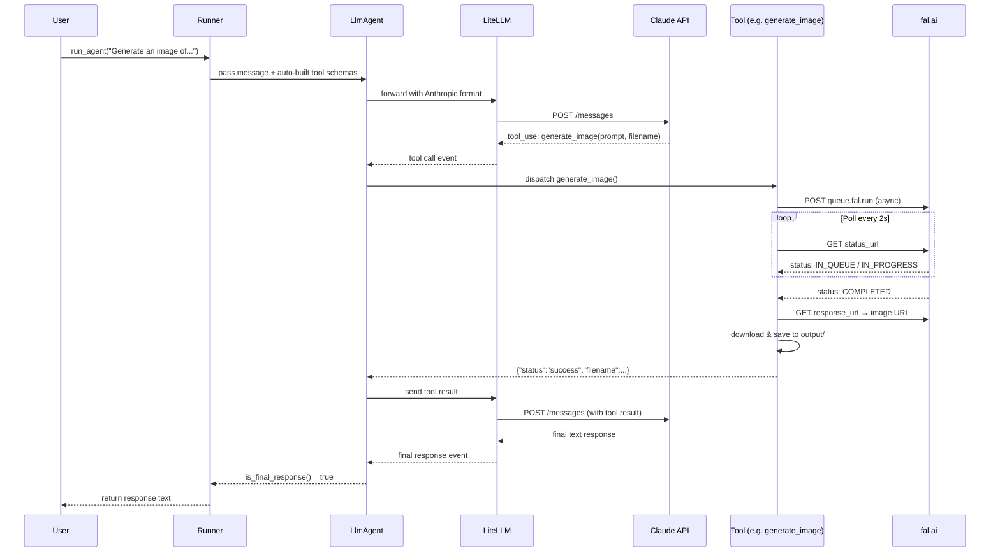

# agent_adk.py — Architecture

> **Framework:** Google ADK &nbsp;|&nbsp; **Model:** Claude Sonnet 4.6 &nbsp;|&nbsp; **Bridge:** LiteLLM

Recreates the same creative-assistant agent from `agent_guide.py` using **Google's Agent Development Kit (ADK)** with **Anthropic Claude Sonnet 4.6** routed via LiteLLM.

---

## High-Level Architecture

```mermaid
flowchart TD
    User([👤 User\nrun_agent&#40;message&#41;])
    Session[InMemorySessionService]
    Runner[ADK Runner\nRunner.run_async&#40;&#41;]
    Agent[LlmAgent\nname=creative_assistant]
    LiteLLM[LiteLLM Bridge\nLiteLlm&#40;anthropic/claude-sonnet-4-6&#41;]
    Claude[☁️ Anthropic API\nclaude-sonnet-4-6]
    GenImg[generate_image&#40;&#41;]
    SaveFile[save_file&#40;&#41;]
    ReadFile[read_file&#40;&#41;]
    Fal[☁️ fal.ai\nFlux Schnell Queue]
    Output[📁 output/]

    User -->|1. wrap in types.Content| Runner
    Runner <-->|2. manage history| Session
    Runner -->|3. send message + tool schemas| Agent
    Agent -->|4. route via bridge| LiteLLM
    LiteLLM -->|5. Anthropic API call| Claude
    Claude -->|6. tool call decision| LiteLLM
    LiteLLM -->|7. dispatch| Agent
    Agent -.->|tool call| GenImg
    Agent -.->|tool call| SaveFile
    Agent -.->|tool call| ReadFile
    GenImg -->|POST + poll queue| Fal
    GenImg -->|save bytes| Output
    Claude -->|8. final response| Runner
    Runner -->|9. event stream| User
```



---

## How It Works

ADK replaces the manual `while` loop from `agent_guide.py` with a **Runner** that handles the full agentic cycle automatically:

1. `run_agent()` creates a session and builds a `Runner`
2. `runner.run_async()` sends the message to the `LlmAgent`
3. The `LlmAgent` calls Claude via the **LiteLLM bridge** (translates ADK's Gemini-native protocol to the Anthropic API format)
4. If Claude decides to call a tool, ADK dispatches to the registered Python function
5. The tool result is automatically appended to conversation history
6. Claude is called again with the result; when it emits a final response, the event stream ends
7. The caller reads `event.content.parts[0].text` from the last `is_final_response()` event

---

## Building Blocks

| Component | Class / Module | Role |
|---|---|---|
| Agent | `google.adk.agents.LlmAgent` | Holds model, instruction, and tool list |
| LiteLLM bridge | `google.adk.models.lite_llm.LiteLlm` | Translates ADK → Anthropic API format |
| Runner | `google.adk.runners.Runner` | Drives the full agentic loop automatically |
| Session | `google.adk.sessions.InMemorySessionService` | Stores conversation history in RAM |
| Message wrapper | `google.genai.types.Content / Part` | Wraps user message into ADK format |
| Tool — generate_image | plain Python function | Calls fal.ai queue, polls, saves image |
| Tool — save_file | plain Python function | Writes UTF-8 text to disk |
| Tool — read_file | plain Python function | Reads UTF-8 text from disk |

> **Key insight:** ADK introspects each function's **name**, **type hints**, and **docstring** to build tool schemas automatically — no manual JSON required.

---

## Data Flow



---

## Tools Reference

| Function | Signature | Description | Returns |
|---|---|---|---|
| `generate_image` | `(prompt: str, filename: str) -> dict` | POSTs to fal.ai async queue, polls until `COMPLETED`, downloads image, saves to `output/` | `{status, filename, url, prompt_used}` |
| `save_file` | `(filename: str, content: str) -> dict` | Writes UTF-8 text via `pathlib.Path.write_text()` | `{status, filename, bytes_written}` |
| `read_file` | `(filename: str) -> dict` | Reads UTF-8 text; returns descriptive error if not found | `{status, filename, content}` |

---

## Comparison: This File vs Siblings

| | `agent_guide.py` | **`agent_adk.py`** (this) | `agent_adk_gemini.py` | `agent_adk_openai.py` |
|---|---|---|---|---|
| Framework | Raw Anthropic API | Google ADK | Google ADK | Google ADK |
| Model | Claude Sonnet 4.6 | Claude Sonnet 4.6 | Gemini 2.0 Flash | GPT-4o |
| Bridge | — | LiteLLM | None (native) | LiteLLM |
| Agent class | manual loop | `LlmAgent` | `Agent` | `LlmAgent` |
| Schema authoring | Manual JSON | Auto (introspection) | Auto (introspection) | Auto (introspection) |
| API key needed | `ANTHROPIC_API_KEY` | `ANTHROPIC_API_KEY` | `GOOGLE_API_KEY` | `OPENAI_API_KEY` |

---

## Configuration

**`.env`** (repo root):
```
ANTHROPIC_API_KEY=your-anthropic-api-key-here
FAL_KEY=your-fal-ai-key-here
```

**Install:**
```bash
pip install -e ".[adk,litellm]"
```

**Run:**
```bash
python image_generation_agent/agent_adk/agent_adk.py
```

Generated images are saved to `image_generation_agent/agent_adk/output/`.
