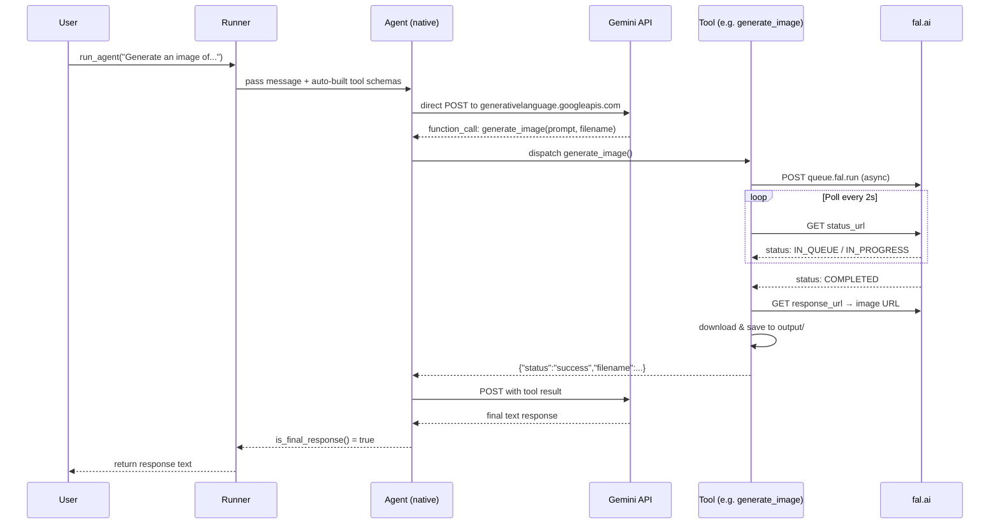

# agent_adk_gemini.py — Architecture

> **Framework:** Google ADK &nbsp;|&nbsp; **Model:** Gemini 2.0 Flash &nbsp;|&nbsp; **Bridge:** None (native)

The simplest of the three ADK variants — Gemini is ADK's **native model**, so no LiteLLM bridge is needed. Uses the plain `Agent` class with the model set as a string.

---

## High-Level Architecture

```mermaid
flowchart TD
    User([👤 User\nrun_agent&#40;message&#41;])
    Session[InMemorySessionService]
    Runner[ADK Runner\nRunner.run_async&#40;&#41;]
    Agent["Agent (native)\nmodel=gemini-2.0-flash"]
    Gemini[☁️ Google AI API\nGemini 2.0 Flash]
    GenImg[generate_image&#40;&#41;]
    SaveFile[save_file&#40;&#41;]
    ReadFile[read_file&#40;&#41;]
    Fal[☁️ fal.ai\nFlux Schnell Queue]
    Output[📁 output/]

    User -->|1. wrap in types.Content| Runner
    Runner <-->|2. manage history| Session
    Runner -->|3. send message + tool schemas| Agent
    Agent -->|4. direct — no bridge| Gemini
    Gemini -->|5. tool call decision| Agent
    Agent -.->|tool call| GenImg
    Agent -.->|tool call| SaveFile
    Agent -.->|tool call| ReadFile
    GenImg -->|POST + poll queue| Fal
    GenImg -->|save bytes| Output
    Gemini -->|6. final response| Runner
    Runner -->|7. event stream| User
```



> **No bridge layer.** Unlike `agent_adk.py` and `agent_adk_openai.py`, the call from `Agent` goes directly to the Google AI API — one fewer hop.

---

## How It Works

This file is structurally identical to `agent_adk.py` with two differences:

1. **`Agent` instead of `LlmAgent`** — the native class for Gemini models; accepts a plain string model name
2. **No LiteLLM** — ADK speaks to the Gemini API directly using `GOOGLE_API_KEY`

The runner pattern, session management, tool definitions, and event-stream extraction are all identical across the three ADK variants.

---

## Building Blocks

| Component | Class / Module | Role |
|---|---|---|
| Agent | `google.adk.agents.Agent` | Native Gemini agent; model set as plain string |
| Runner | `google.adk.runners.Runner` | Drives the full agentic loop automatically |
| Session | `google.adk.sessions.InMemorySessionService` | Stores conversation history in RAM |
| Message wrapper | `google.genai.types.Content / Part` | Wraps user message into ADK format |
| Tool — generate_image | plain Python function | Calls fal.ai queue, polls, saves image |
| Tool — save_file | plain Python function | Writes UTF-8 text to disk |
| Tool — read_file | plain Python function | Reads UTF-8 text from disk |

> **Smallest install** of the three ADK variants — no `litellm` package needed.

---

## Data Flow



---

## Tools Reference

| Function | Signature | Description | Returns |
|---|---|---|---|
| `generate_image` | `(prompt: str, filename: str) -> dict` | POSTs to fal.ai async queue, polls until `COMPLETED`, downloads image, saves to `output/` | `{status, filename, url, prompt_used}` |
| `save_file` | `(filename: str, content: str) -> dict` | Writes UTF-8 text via `pathlib.Path.write_text()` | `{status, filename, bytes_written}` |
| `read_file` | `(filename: str) -> dict` | Reads UTF-8 text; returns descriptive error if not found | `{status, filename, content}` |

---

## Comparison: This File vs Siblings

| | `agent_guide.py` | `agent_adk.py` | **`agent_adk_gemini.py`** (this) | `agent_adk_openai.py` |
|---|---|---|---|---|
| Framework | Raw Anthropic API | Google ADK | Google ADK | Google ADK |
| Model | Claude Sonnet 4.6 | Claude Sonnet 4.6 | Gemini 2.0 Flash | GPT-4o |
| Bridge | — | LiteLLM | **None (native)** | LiteLLM |
| Agent class | manual loop | `LlmAgent` | **`Agent`** | `LlmAgent` |
| Schema authoring | Manual JSON | Auto | Auto | Auto |
| Extra packages | — | `litellm` | **none** | `litellm` |
| API key needed | `ANTHROPIC_API_KEY` | `ANTHROPIC_API_KEY` | `GOOGLE_API_KEY` | `OPENAI_API_KEY` |

---

## Configuration

**`.env`** (repo root):
```
GOOGLE_API_KEY=your-google-api-key-here
FAL_KEY=your-fal-ai-key-here
```

Get a Google API key at [aistudio.google.com/apikey](https://aistudio.google.com/apikey).

**Install** (smallest of the three ADK variants — no litellm needed):
```bash
pip install -e ".[adk]"
```

**Run:**
```bash
python image_generation_agent/agent_adk_gemini/agent_adk_gemini.py
```

Generated images are saved to `image_generation_agent/agent_adk_gemini/output/`.
