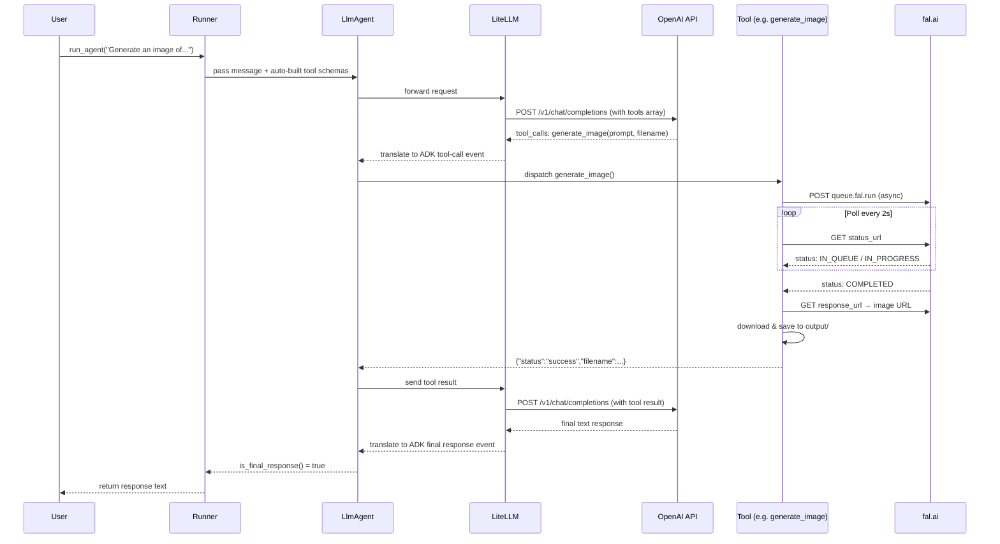

# agent_adk_openai.py — Architecture

> **Framework:** Google ADK &nbsp;|&nbsp; **Model:** GPT-4o &nbsp;|&nbsp; **Bridge:** LiteLLM

Recreates the same creative-assistant agent using **Google ADK** with **OpenAI GPT-4o** routed via LiteLLM. Structurally identical to `agent_adk.py` — the only difference is the model and API key.

---

## High-Level Architecture

```mermaid
flowchart TD
    User([👤 User\nrun_agent&#40;message&#41;])
    Session[InMemorySessionService]
    Runner[ADK Runner\nRunner.run_async&#40;&#41;]
    Agent[LlmAgent\nname=creative_assistant]
    LiteLLM[LiteLLM Bridge\nLiteLlm&#40;openai/gpt-4o&#41;]
    OpenAI[☁️ OpenAI API\ngpt-4o]
    GenImg[generate_image&#40;&#41;]
    SaveFile[save_file&#40;&#41;]
    ReadFile[read_file&#40;&#41;]
    Fal[☁️ fal.ai\nFlux Schnell Queue]
    Output[📁 output/]

    User -->|1. wrap in types.Content| Runner
    Runner <-->|2. manage history| Session
    Runner -->|3. send message + tool schemas| Agent
    Agent -->|4. route via bridge| LiteLLM
    LiteLLM -->|5. translate to OpenAI format| OpenAI
    OpenAI -->|6. tool_calls response| LiteLLM
    LiteLLM -->|7. translate back to ADK format| Agent
    Agent -.->|tool call| GenImg
    Agent -.->|tool call| SaveFile
    Agent -.->|tool call| ReadFile
    GenImg -->|POST + poll queue| Fal
    GenImg -->|save bytes| Output
    OpenAI -->|8. final response| LiteLLM
    LiteLLM -->|9. translate| Agent
    Agent -->|is_final_response| Runner
    Runner -->|10. event stream| User
```



---

## How It Works

LiteLLM acts as a **universal adapter**: ADK speaks Gemini's internal protocol, but LiteLLM intercepts every model call and reformats it for the target API. For GPT-4o this means:

- ADK's tool schema format → OpenAI `tools` array
- ADK's message history → OpenAI `messages` array
- OpenAI `tool_calls` response → ADK tool-call event (translated back)

Everything else — Runner, session, tool dispatch, event stream — is identical to `agent_adk.py`.

---

## Building Blocks

| Component | Class / Module | Role |
|---|---|---|
| Agent | `google.adk.agents.LlmAgent` | Holds model, instruction, and tool list |
| LiteLLM bridge | `google.adk.models.lite_llm.LiteLlm` | Translates ADK → OpenAI chat-completions format |
| Runner | `google.adk.runners.Runner` | Drives the full agentic loop automatically |
| Session | `google.adk.sessions.InMemorySessionService` | Stores conversation history in RAM |
| Message wrapper | `google.genai.types.Content / Part` | Wraps user message into ADK format |
| Tool — generate_image | plain Python function | Calls fal.ai queue, polls, saves image |
| Tool — save_file | plain Python function | Writes UTF-8 text to disk |
| Tool — read_file | plain Python function | Reads UTF-8 text from disk |

---

## Data Flow



---

## The LiteLLM Bridge in Detail

```
ADK Runner
    │
    ▼
LiteLlm(model="openai/gpt-4o")
    │  translates:
    │  • ADK tool schemas  →  OpenAI "tools" array
    │  • ADK messages      →  OpenAI "messages" array
    │  • OpenAI tool_calls →  ADK tool-call event  (response path)
    ▼
api.openai.com/v1/chat/completions
```

The same pattern applies to `agent_adk.py` with `"anthropic/claude-sonnet-4-6"` — LiteLLM is the shared glue for any non-Gemini model.

---

## Tools Reference

| Function | Signature | Description | Returns |
|---|---|---|---|
| `generate_image` | `(prompt: str, filename: str) -> dict` | POSTs to fal.ai async queue, polls until `COMPLETED`, downloads image, saves to `output/` | `{status, filename, url, prompt_used}` |
| `save_file` | `(filename: str, content: str) -> dict` | Writes UTF-8 text via `pathlib.Path.write_text()` | `{status, filename, bytes_written}` |
| `read_file` | `(filename: str) -> dict` | Reads UTF-8 text; returns descriptive error if not found | `{status, filename, content}` |

---

## Comparison: This File vs Siblings

| | `agent_guide.py` | `agent_adk.py` | `agent_adk_gemini.py` | **`agent_adk_openai.py`** (this) |
|---|---|---|---|---|
| Framework | Raw Anthropic API | Google ADK | Google ADK | Google ADK |
| Model | Claude Sonnet 4.6 | Claude Sonnet 4.6 | Gemini 2.0 Flash | GPT-4o |
| Bridge | — | LiteLLM | None (native) | **LiteLLM** |
| Agent class | manual loop | `LlmAgent` | `Agent` | **`LlmAgent`** |
| Schema authoring | Manual JSON | Auto | Auto | Auto |
| API key needed | `ANTHROPIC_API_KEY` | `ANTHROPIC_API_KEY` | `GOOGLE_API_KEY` | **`OPENAI_API_KEY`** |
| HTTP target | api.anthropic.com | api.anthropic.com | generativelanguage… | **api.openai.com** |

---

## Configuration

**`.env`** (repo root):
```
OPENAI_API_KEY=your-openai-api-key-here
FAL_KEY=your-fal-ai-key-here
```

**Install:**
```bash
pip install -e ".[adk,litellm]"
```

**Run:**
```bash
python image_generation_agent/agent_adk_openai/agent_adk_openai.py
```

Generated images are saved to `image_generation_agent/agent_adk_openai/output/`.
