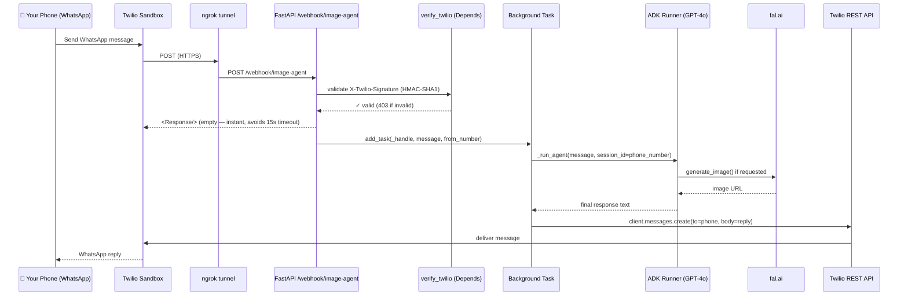

# whatsapp_twilio — Architecture

> **Prototype** &nbsp;|&nbsp; **Interface:** WhatsApp via Twilio sandbox (official) &nbsp;|&nbsp; **Agent:** agent_adk_openai (GPT-4o)

A FastAPI server hosting multiple WhatsApp agents. Each agent has its own endpoint — point different Twilio numbers at different paths. Each WhatsApp number gets its own persistent ADK session so the agent remembers conversation context within a single server run.

---

## Message Flow



**Why the background task pattern?**
Twilio has a **15-second hard timeout** on webhook responses. AI agent calls (OpenAI + fal.ai) can take 5–15 seconds. Returning `<Response/>` immediately and replying via the Twilio REST API decouples agent runtime from Twilio's timeout entirely.

---

## File Structure

```
whatsapp_twilio/
  whatsapp_twilio.py        ← FastAPI app, mounts all agent routers
  architecture.md           ← this file
  output/                   ← reserved for future use
  core/
    twilio_verify.py        ← shared FastAPI Depends for HMAC signature check
  agents/
    image_agent.py          ← APIRouter for image generation agent
```

**Adding a new agent:**
1. Create `agents/<your_agent>.py` with an `APIRouter`
2. Add `app.include_router(your_router, prefix="/webhook/<your-agent>")` in `whatsapp_twilio.py`
3. Point a Twilio number at `https://<your-host>/webhook/<your-agent>`

---

## Key Design Decisions

| Concern | Decision |
|---|---|
| **Twilio timeout** | Webhook returns empty `<Response/>` instantly. Agent runs in `BackgroundTasks`; reply sent via Twilio REST API (`client.messages.create`). |
| **Security** | Every request validated against Twilio's HMAC-SHA1 (`X-Twilio-Signature`) via a shared `verify_twilio` FastAPI dependency. Returns HTTP 403 on failure. |
| **Multi-agent routing** | Each agent is an `APIRouter` mounted at its own prefix. One server, one bill, unlimited agents. |
| **Session memory** | Module-level `InMemorySessionService` + `Runner` per agent. Sender's phone number used as `session_id` — each number has its own conversation thread. |
| **Code reuse** | Imports `root_agent` from `agent_adk_openai` — no duplication of tools or agent config. |
| **ngrok compatibility** | `_reconstruct_url()` in `core/twilio_verify.py` reads `X-Forwarded-Proto` + `Host` header so HMAC check passes through the tunnel. |
| **Async safety** | Sync Twilio REST call wrapped in `asyncio.to_thread()` so it doesn't block the event loop. |

---

## Environment Variables

| Variable | Where to get it | Notes |
|---|---|---|
| `TWILIO_ACCOUNT_SID` | Twilio console → Account Info | |
| `TWILIO_AUTH_TOKEN` | Twilio console → Account Info | |
| `TWILIO_WHATSAPP_FROM` | Twilio sandbox page | e.g. `whatsapp:+14155238886` |
| `OPENAI_API_KEY` | platform.openai.com | |
| `FAL_KEY` | fal.ai/dashboard/keys | |

---

## Running Locally

```bash
# 1. Install deps
pip install -e ".[whatsapp]"

# 2. Start the server
uvicorn image_generation_agent.whatsapp_twilio.whatsapp_twilio:app --reload --port 8000

# 3. Expose it publicly (separate terminal)
ngrok http 8000

# 4. In the Twilio sandbox console, set "When a message comes in" to:
#    https://<your-ngrok-id>.ngrok-free.app/webhook/image-agent   (HTTP POST)

# 5. Activate the sandbox: send the join phrase from your WhatsApp
#    to the sandbox number shown in the Twilio console.
```

---

## Limitations (Prototype)

> **In-memory sessions only** — conversation history is lost when the server restarts.
>
> **No native image attachment** — images are saved locally; the fal.ai public URL appears in the text reply.
>
> **Twilio sandbox** — limited to approved numbers. Switch to a production Twilio number or Meta Cloud API for real deployments.
