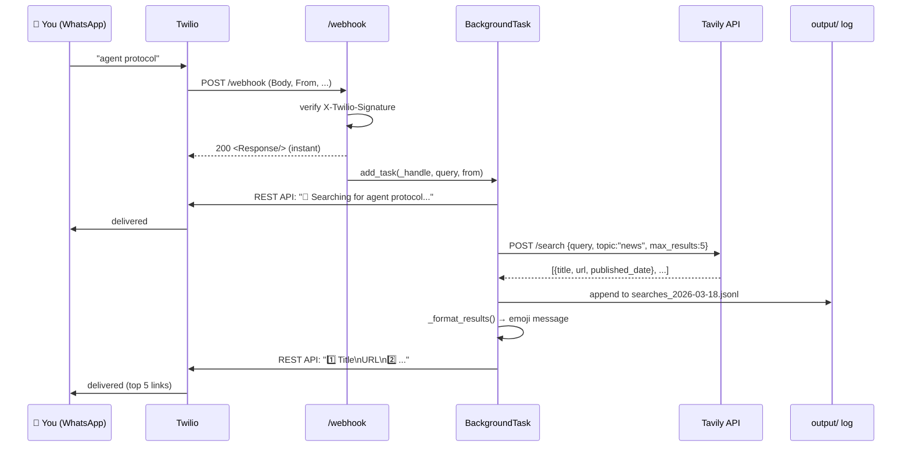

# agent_tech_finder.py — Architecture

> **Interface:** WhatsApp (Twilio) &nbsp;|&nbsp; **Search:** Tavily REST API &nbsp;|&nbsp; **Framework:** FastAPI

Send any tech topic via WhatsApp → get the top 5 latest news articles back in seconds. No LLM involved — just fast search and clean formatting.

---

## High-Level Architecture

```mermaid
flowchart TD
    User([📱 You\nWhatsApp message])
    Twilio[☁️ Twilio\nWhatsApp sandbox]
    Webhook[POST /webhook\nFastAPI]
    Verify[Twilio signature\nverification]
    BG[BackgroundTask\n_handle&#40;query, from&#41;]
    Ack[Empty TwiML\n&lt;Response/&gt;]
    Searching[send_reply\n🔎 Searching...]
    Tavily[☁️ Tavily\nnews search API]
    Format[_format_results&#40;&#41;\n5 emoji-titled links]
    Log[📁 output/\nsearches_YYYY-MM-DD.jsonl]
    Reply[send_reply\nTop 5 links]

    User -->|text: 'agent protocol'| Twilio
    Twilio -->|HTTP POST form data| Webhook
    Webhook --> Verify
    Verify -->|valid| Ack
    Ack -->|200 immediately| Twilio
    Verify --> BG
    BG --> Searching
    Searching -->|via Twilio REST API| Twilio
    Twilio -->|delivered| User
    BG -->|POST api.tavily.com/search| Tavily
    Tavily -->|results JSON| BG
    BG --> Log
    BG --> Format
    Format --> Reply
    Reply -->|via Twilio REST API| Twilio
    Twilio -->|delivered| User
```



---

## Why the Background Task Pattern?

Twilio will mark a webhook as failed if it doesn't receive a response within **15 seconds**. Tavily search + network round-trips can take 2–5 seconds, which is fine — but to be safe and consistent with the rest of this repo:

1. `/webhook` returns `<Response/>` instantly (< 50ms)
2. The actual search runs in a `FastAPI BackgroundTask`
3. Results are sent proactively via the **Twilio REST API** (not TwiML)

This pattern also allows sending two separate messages: a "Searching..." acknowledgement and then the actual results.

---

## Building Blocks

| Component | What it is | Role |
|---|---|---|
| FastAPI app | `fastapi.FastAPI` | Hosts the `/webhook` POST endpoint |
| `_verify_twilio()` | async function | Validates `X-Twilio-Signature` header — rejects non-Twilio requests |
| `_search()` | async httpx POST | Calls Tavily `topic=news` search; returns list of result dicts |
| `_format_results()` | pure function | Turns result list into a WhatsApp-friendly emoji message |
| `_send_reply()` | async Twilio REST | Sends a message via `twilio.rest.Client.messages.create` (run in thread) |
| `_log_search()` | sync file write | Appends each search + results to a daily `.jsonl` file in `output/` |
| `_handle()` | async background task | Orchestrates: send ack → search → log → format → send results |
| `BackgroundTasks` | FastAPI built-in | Runs `_handle()` after the HTTP response is returned |

---

## Data Flow



---

## Message Format

**You send:**
```
agent protocol
```

**Bot replies (message 1):**
```
🔎 Searching for agent protocol...
```

**Bot replies (message 2):**
```
🔍 Top 5 results for:
agent protocol

1️⃣ *Anthropic Launches Agent Protocol Standard*  📅 2026-03-17
https://techcrunch.com/...

2️⃣ *Google DeepMind Adopts Agent Protocol in Gemini*  📅 2026-03-16
https://...

3️⃣ *Agent Protocol: The Universal API for AI Agents*
https://...

4️⃣ *OpenAI Responds to Agent Protocol Proposal*  📅 2026-03-15
https://...

5️⃣ *Why Agent Protocol Matters for Developers*
https://...
```

---

## Tools Reference

| Function | Signature | Description | Returns |
|---|---|---|---|
| `_search` | `(query: str, max_results: int) -> list[dict]` | Async Tavily `topic=news` search | `[{title, url, published_date, snippet}]` |
| `_format_results` | `(query: str, results: list) -> str` | Formats results as WhatsApp message with emoji numbering | formatted string |
| `_send_reply` | `(to: str, body: str) -> None` | Sends WhatsApp message via Twilio REST API | — |
| `_log_search` | `(query: str, results: list) -> None` | Appends to daily JSONL log in `output/` | — |
| `_verify_twilio` | `(request: Request) -> None` | Validates Twilio HMAC signature; raises 403 if invalid | — |

---

## Comparison: Tech Finder vs Image Agent (WhatsApp)

| | **`agent_tech_finder`** (this) | `whatsapp_twilio/image_agent` |
|---|---|---|
| Purpose | Find latest news articles | Generate images |
| LLM | None | GPT-4o via LiteLLM |
| External API | Tavily (search) | fal.ai (image gen) + OpenAI |
| Response time | ~2–5s | ~15–30s |
| Output | 5 links as text | Image + text |
| Port | 8001 | 8000 |
| Framework | FastAPI (standalone) | FastAPI (hub router) |

---

## Configuration

**`.env`** (repo root):
```
TAVILY_API_KEY=your-tavily-api-key-here
TWILIO_ACCOUNT_SID=ACxxxxxxxxxxxxxxxxxxxxxxxxxxxxxxxx
TWILIO_AUTH_TOKEN=your-twilio-auth-token-here
TWILIO_WHATSAPP_FROM=whatsapp:+14155238886
```

**Install:**
```bash
pip install -e ".[tech-finder]"
```

**Run:**
```bash
uvicorn tech_finder_agent.agent_tech_finder.agent_tech_finder:app --reload --port 8001
```

**Expose publicly (separate terminal):**
```bash
ngrok http 8001
```

**Twilio sandbox console:**
Set "When a message comes in" → `https://<ngrok-id>.ngrok-free.app/webhook` (POST)

Search logs are saved to `tech_finder_agent/agent_tech_finder/output/searches_YYYY-MM-DD.jsonl`.
