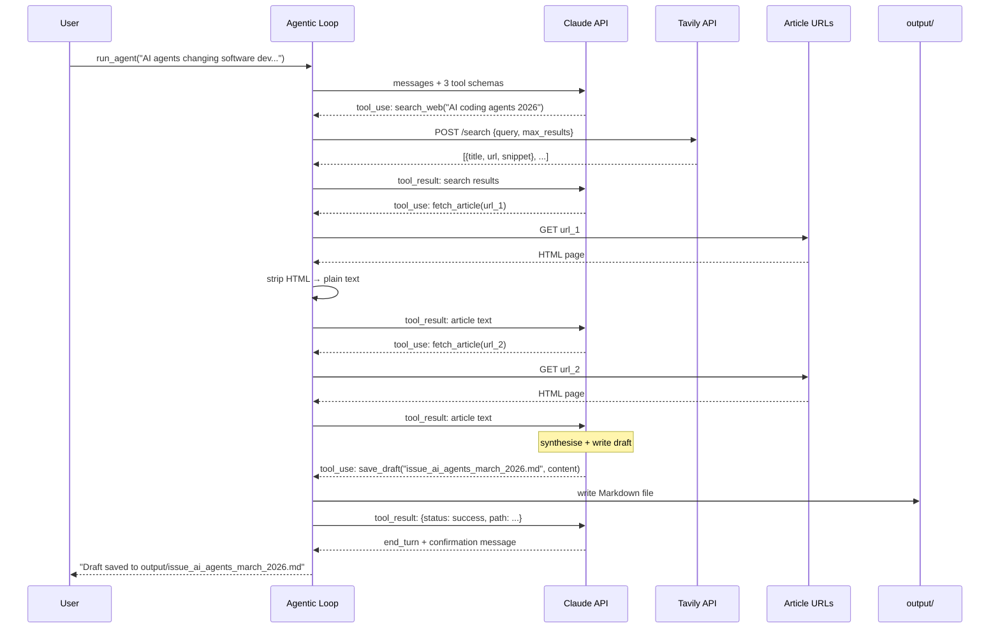

# agent_tech_newsletter.py — Architecture

> **Framework:** Raw Anthropic API &nbsp;|&nbsp; **Model:** Claude Sonnet 4.6 &nbsp;|&nbsp; **Search:** Tavily REST API &nbsp;|&nbsp; **Interface:** CLI or WhatsApp (Twilio)

Researches a tech topic, reads source articles, and drafts a full newsletter issue in the style of **The Tech Blueprint** — saved as a Markdown file and (in WhatsApp mode) delivered back to the user via Twilio.

---

## High-Level Architecture

```mermaid
flowchart TD
    User([👤 User\ntopic string])
    Loop[Agentic Loop\nmax 15 iterations]
    Claude[☁️ Anthropic API\nclaude-sonnet-4-6]
    SearchWeb[search_web&#40;&#41;]
    FetchArticle[fetch_article&#40;&#41;]
    SaveDraft[save_draft&#40;&#41;]
    Tavily[☁️ Tavily\nREST API]
    Web[☁️ Article URLs\nhttpx GET]
    Output[📁 output/\nissue_*.md]

    User -->|1. topic| Loop
    Loop -->|2. messages + tool schemas| Claude
    Claude -->|3. tool_use: search_web| Loop
    Loop -->|4. dispatch| SearchWeb
    SearchWeb -->|POST api.tavily.com/search| Tavily
    Tavily -->|titles, urls, snippets| SearchWeb
    SearchWeb -->|results dict| Loop
    Loop -->|5. tool result → Claude| Claude
    Claude -->|6. tool_use: fetch_article| Loop
    Loop -->|7. dispatch| FetchArticle
    FetchArticle -->|GET url via httpx| Web
    Web -->|HTML| FetchArticle
    FetchArticle -->|plain text ≤4000 chars| Loop
    Loop -->|8. tool result → Claude| Claude
    Claude -->|9. tool_use: save_draft| Loop
    Loop -->|10. dispatch| SaveDraft
    SaveDraft -->|write .md file| Output
    Claude -->|11. end_turn + confirmation| Loop
    Loop -->|final text| User
```



---

## How It Works

1. `run_agent(topic)` sends the topic to Claude with the system prompt and tool schemas
2. Claude calls `search_web` 1–2 times to find recent articles on the topic via Tavily
3. Claude selects 2–3 of the most relevant URLs and calls `fetch_article` on each
4. Each article's HTML is fetched with `httpx`, stripped to plain text by a built-in HTML parser, and truncated to 4,000 characters
5. Claude synthesises all sources and writes the full newsletter draft in The Tech Blueprint format
6. Claude calls `save_draft` to write the Markdown file to `output/`
7. The loop ends when Claude returns `stop_reason = "end_turn"`

> **No SDK for Tavily** — the Tavily search API is called directly via `httpx` POST, keeping dependencies minimal. No new packages beyond `anthropic` are required.

---

## Building Blocks

| Component | What it is | Role |
|---|---|---|
| `run_agent()` | agentic loop function | Drives the conversation; dispatches tools; returns final response |
| `TOOLS` | list of JSON schemas | Declares the 3 tools to Claude — names, descriptions, parameter types |
| `TOOL_HANDLERS` | dict of callables | Maps tool name → Python function |
| `SYSTEM_PROMPT` | string | Encodes the newsletter voice, structure, and research process |
| `search_web()` | httpx POST to Tavily | Returns list of `{title, url, snippet, published_date}` |
| `fetch_article()` | httpx GET + HTML parser | Returns clean article text (≤4,000 chars) |
| `save_draft()` | pathlib write | Saves Markdown draft to `output/` |
| `_HTMLTextExtractor` | `html.parser.HTMLParser` subclass | Strips script/style/nav tags; extracts readable text |

---

## Data Flow



---

## Tools Reference

| Function | Signature | Description | Returns |
|---|---|---|---|
| `search_web` | `(query: str, max_results: int = 5) -> dict` | POSTs to Tavily REST API; returns recent article titles, URLs, and snippets | `{status, query, results: [{title, url, snippet, published_date}]}` |
| `fetch_article` | `(url: str) -> dict` | GETs the URL, strips HTML using built-in parser, truncates to 4,000 chars | `{status, url, content}` |
| `save_draft` | `(filename: str, content: str) -> dict` | Writes Markdown to `output/` using `pathlib.Path.write_text()` | `{status, path, bytes_written}` |

---

## Newsletter Output Format

The agent always produces a draft with this structure:

```
THE TECH BLUEPRINT | Issue — [Date]
# [Subject line]
> [One-sentence hook]

## The Big Picture       ← 2 paragraphs, context + why now
## Deep Dive: [Topic]    ← 3–4 paragraphs, analysis with cited sources
## What This Means For You ← 4 actionable bullets
## Quick Hits            ← 3 brief linked news items
## Worth Reading         ← 2–3 article recommendations
```

Draft is saved as `.md` — paste directly into Beehiiv's Markdown editor.

---

## Comparison: This Agent vs Image Generation Agents

| | `agent_tech_newsletter.py` | `agent_guide.py` | ADK agents |
|---|---|---|---|
| Framework | Raw Anthropic API | Raw Anthropic API | Google ADK |
| Model | Claude Sonnet 4.6 | Claude Sonnet 4.6 | Claude / Gemini / GPT-4o |
| External APIs | Tavily (search) + any URL (fetch) | fal.ai (image gen) | fal.ai |
| Output | Markdown newsletter draft | PNG image | PNG image |
| Loop driver | manual `for` loop | manual `for` loop | ADK Runner |
| Max iterations | 15 | 10 | unlimited (ADK managed) |

---

## Configuration

**`.env`** (repo root):
```
ANTHROPIC_API_KEY=your-anthropic-api-key-here
TAVILY_API_KEY=your-tavily-api-key-here
```

Get a free Tavily key at [tavily.com](https://tavily.com) — the free tier allows 1,000 searches/month.

**Install:**
```bash
pip install -e ".[newsletter]"
```

**CLI — run once for a fixed topic:**
```bash
python tech_newsletter_agent/agent_tech_newsletter/agent_tech_newsletter.py
```
Edit the `topic` variable at the bottom of the file before running.

**WhatsApp — live webhook:**
```bash
uvicorn tech_newsletter_agent.agent_tech_newsletter.agent_tech_newsletter:app --reload --port 8002
ngrok http 8002
```
Set Twilio sandbox → `https://<ngrok-id>.ngrok-free.app/webhook` (POST), then text:
> _"create newsletter on AI agents"_

The bot acknowledges immediately, drafts the newsletter (~30–60s), splits it across multiple WhatsApp messages if needed, and delivers it back.

Generated drafts are saved to `tech_newsletter_agent/agent_tech_newsletter/output/`.
