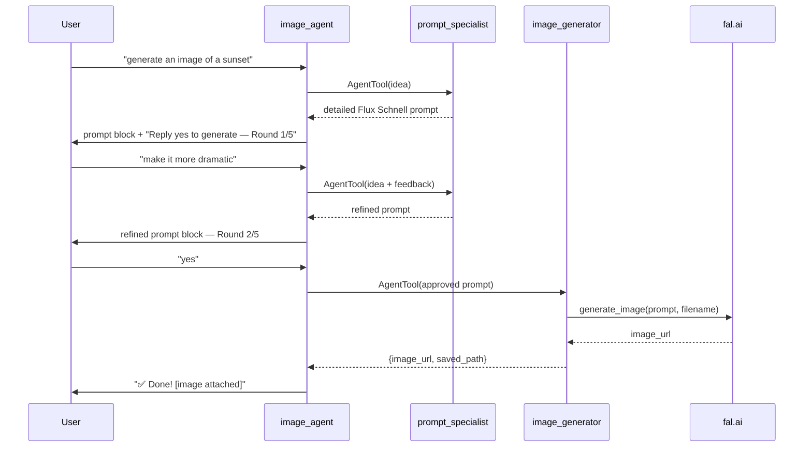
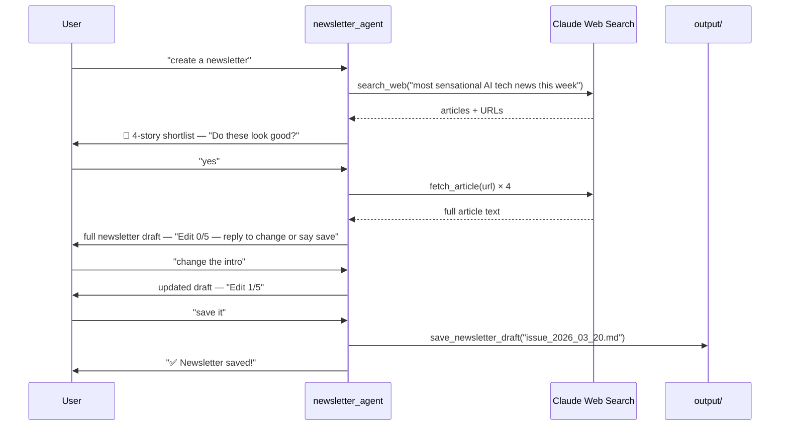
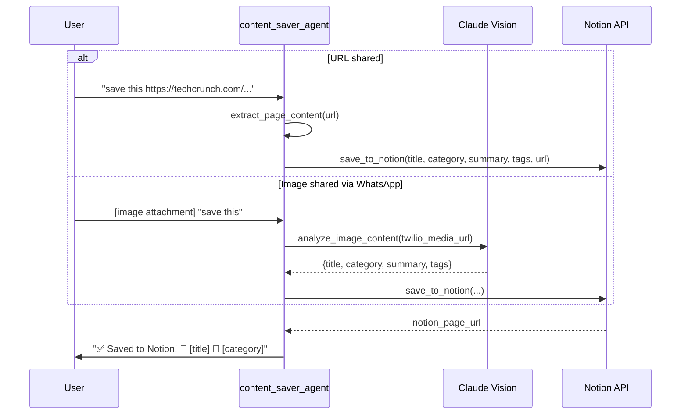
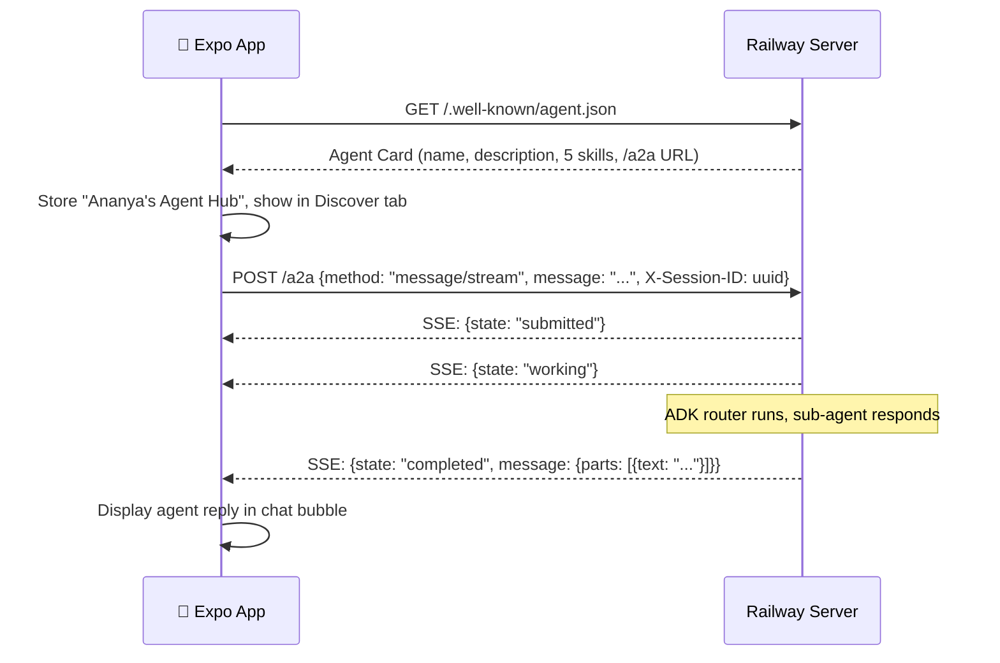
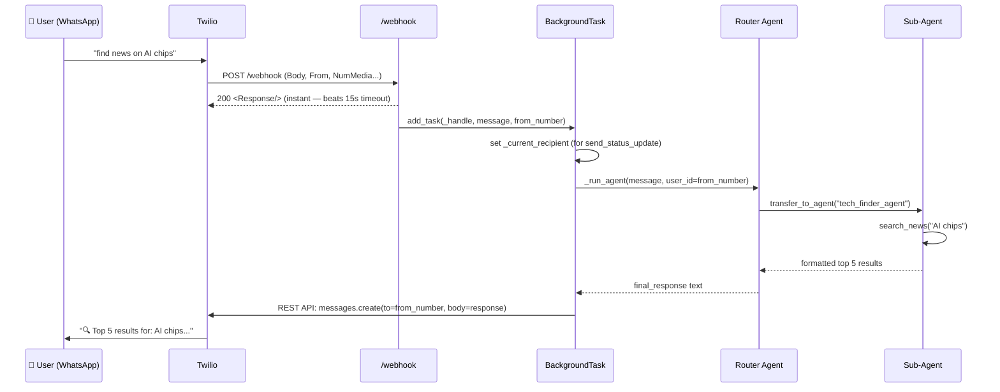

# agent_whatsapp_hub — Architecture

> **Framework:** Google ADK &nbsp;|&nbsp; **Model:** Claude Sonnet 4.6 (via LiteLLM) &nbsp;|&nbsp; **Interface:** WhatsApp (Twilio) + Mobile App (A2A) &nbsp;|&nbsp; **Deployed on:** Railway

A single server hosts all agents behind two interfaces: WhatsApp (Twilio) and any A2A-compatible mobile app. The ADK router classifies the user's intent and transfers control to the right sub-agent, which handles the full task — including multi-turn flows — before transferring back.

---

## High-Level Architecture

```mermaid
flowchart TD
    WA([📱 WhatsApp])
    MB([📱 Mobile App\nExpo / A2A Client])
    Twilio[☁️ Twilio]

    subgraph Railway Server
        Webhook[POST /webhook\nTwilio interface]
        A2AEndpoint[POST /a2a\nA2A interface]
        AgentCard[GET /.well-known/agent.json\nAgent Card]
        BG[BackgroundTask\n_handle&#40;&#41;]
        Router[🤖 Router Agent\nLlmAgent + sub_agents]

        ImageAgent[🖼️ image_agent]
        PromptAgent[✍️ prompt_agent]
        NewsletterAgent[📰 newsletter_agent]
        TechFinderAgent[🔍 tech_finder_agent]
        ContentSaverAgent[💾 content_saver_agent]
    end

    FalAI[☁️ fal.ai\nFlux Schnell]
    ClaudeSearch[☁️ Claude\nWeb Search]
    Notion[☁️ Notion API]
    Output[📁 output/\nimages + drafts]

    WA -->|message| Twilio
    Twilio -->|POST form| Webhook
    Webhook -->|200 instantly| Twilio
    Webhook --> BG
    BG --> Router

    MB -->|GET| AgentCard
    MB -->|POST JSON-RPC| A2AEndpoint
    A2AEndpoint --> Router
    A2AEndpoint -->|SSE stream| MB

    Router -->|transfer| ImageAgent
    Router -->|transfer| PromptAgent
    Router -->|transfer| NewsletterAgent
    Router -->|transfer| TechFinderAgent
    Router -->|transfer| ContentSaverAgent

    ImageAgent -->|generate_image| FalAI
    FalAI --> Output

    NewsletterAgent -->|search_web| ClaudeSearch
    NewsletterAgent -->|fetch_article| ClaudeSearch
    NewsletterAgent -->|save_newsletter_draft| Output

    TechFinderAgent -->|search_news| ClaudeSearch
    ContentSaverAgent -->|extract_page_content| ClaudeSearch
    ContentSaverAgent -->|analyze_image_content| ClaudeSearch
    ContentSaverAgent -->|save_to_notion| Notion

    BG -->|Twilio REST API| Twilio
    Twilio --> WA
```



---

## Dual Interface Design

The same Railway server handles two clients simultaneously with no conflict:

| Interface | Endpoint | Client | Response pattern |
|---|---|---|---|
| WhatsApp | `POST /webhook` | Twilio sandbox | Return `<Response/>` instantly, reply via Twilio REST API in background |
| Mobile App | `POST /a2a` | Expo app (A2A protocol) | Stream SSE events: `submitted → working → completed` |
| Discovery | `GET /.well-known/agent.json` | Expo app | Returns Agent Card JSON describing all 5 skills |

Both interfaces call the same `_run_agent(message, user_id)` function — the routing and agent logic is identical regardless of which client sent the message.

---

## Routing Logic

The **Router Agent** receives every message and transfers to the right specialist:

| User says… | Routed to |
|---|---|
| "generate an image of…" | `image_agent` |
| "write me a prompt for…" | `prompt_agent` |
| "create a newsletter" / "draft newsletter" | `newsletter_agent` |
| "find latest news on…" | `tech_finder_agent` |
| "save this https://…" / shares a link or image | `content_saver_agent` |
| General questions | Router answers directly |

---

## The Five Sub-Agents

### 1. Image Agent (`image_agent`)

Conversational image creation with human-in-the-loop prompt approval (max 5 refinement rounds).



Uses `AgentTool` (not `sub_agents`) so `image_agent` stays in control of the full orchestration loop.

---

### 2. Prompt Agent (`prompt_agent`)

Writes a polished Flux Schnell prompt without generating the image. Returns it formatted for copying.

> User: *"write me a prompt for a neon cyberpunk alley"*
> Agent: *"📝 Your Flux Schnell Prompt: [detailed prompt]"*

---

### 3. Newsletter Agent (`newsletter_agent`)

Multi-phase conversational flow — finds news, confirms with the user, writes the newsletter, allows up to 5 edit rounds.



**Newsletter format (exact Tech Blueprint structure):**
- Welcome block with 4 story headlines
- 🌎 Transformational News → What / Why / How
- ☄️ Educational News → What / Why / How
- 💥 Creativity Corner → What / Why / How
- 🤖 Hi-Tech News → What / Why / How
- 🔮 Magical Productivity Hack (named framework + 5 action steps)

---

### 4. Tech Finder Agent (`tech_finder_agent`)

Fast news search — returns the top 5 latest articles on any tech topic.

```
🔍 Top 5 results for: humanoid robots

1️⃣ *Figure 02 Ships to BMW Factory*  📅 2026-03-19
https://...

2️⃣ *Tesla Optimus Hits 1,000 Units*  📅 2026-03-18
https://...
```

---

### 5. Content Saver Agent (`content_saver_agent`)

Saves URLs and images to the user's Notion workspace with smart categorisation.



---

## Session Management

Sessions are keyed by the user's identity — phone number for WhatsApp, `X-Session-ID` header for the mobile app:

| Client | Session key | Where set |
|---|---|---|
| WhatsApp | `From` field (e.g. `whatsapp:+44...`) | Twilio form data |
| Mobile app | `X-Session-ID` header | App generates UUID on first launch, stores in `expo-secure-store` |

`InMemorySessionService` stores full conversation history per user. Sessions reset on server restart.

---

## A2A Protocol Flow (Mobile App)



---

## Full Data Flow — WhatsApp (Sequence)



---

## All Tools Reference

| Tool | Used by | External API | Returns |
|---|---|---|---|
| `generate_image` | `image_generator` | fal.ai Flux Schnell (async queue) | `{image_url, saved_path, filename}` |
| `search_news` | `tech_finder_agent` | Claude native web search | `{message: WhatsApp-formatted string}` |
| `search_web` | `newsletter_agent` | Claude native web search | `{content: titles, URLs, summaries}` |
| `fetch_article` | `newsletter_agent` | httpx GET + HTML strip | `{content: plain text ≤4000 chars}` |
| `save_newsletter_draft` | `newsletter_agent` | — local file | `{path, bytes_written}` |
| `extract_page_content` | `content_saver_agent` | httpx GET + HTML strip | `{title, content, domain, url}` |
| `analyze_image_content` | `content_saver_agent` | Claude Vision (base64) | `{title, category, summary, tags}` |
| `save_to_notion` | `content_saver_agent` | Notion REST API | `{notion_url, title, category}` |
| `send_status_update` | all agents | Twilio REST API | Sends progress message to WhatsApp |

---

## Building Blocks Summary

| Component | Type | Role |
|---|---|---|
| `router_agent` | `LlmAgent` + `sub_agents` | Classifies intent, transfers to specialist |
| `image_agent` | `LlmAgent` + `AgentTool` | Multi-turn prompt → approve → generate loop |
| `prompt_specialist` | `LlmAgent`, no tools | Writes detailed Flux Schnell prompts |
| `image_generator` | `LlmAgent` + `generate_image` | Calls fal.ai, returns image URL |
| `prompt_agent` | `LlmAgent`, no tools | Standalone prompt writing |
| `newsletter_agent` | `LlmAgent` + 4 tools | Multi-phase: discover → confirm → write → edit → save |
| `tech_finder_agent` | `LlmAgent` + `search_news` | Top 5 latest news links |
| `content_saver_agent` | `LlmAgent` + 4 tools | URL/image → Notion with AI categorisation |
| `InMemorySessionService` | ADK | Per-user conversation history |
| `Runner` | ADK | Drives the agentic loop |
| `FastAPI BackgroundTasks` | FastAPI | Runs agent after instant 200 response |
| `POST /webhook` | FastAPI route | Twilio WhatsApp interface |
| `POST /a2a` | FastAPI route | A2A mobile app interface (SSE streaming) |
| `GET /.well-known/agent.json` | FastAPI route | A2A Agent Card discovery |

---

## Why `sub_agents` for routing vs `AgentTool` for image workflow?

| Mechanism | Where used | Why |
|---|---|---|
| `sub_agents` + `transfer_to_agent` | Router → all specialists | Transfer preserves conversation continuity across multiple user messages |
| `AgentTool` | `image_agent` → `prompt_specialist` / `image_generator` | Parent gets the result back and orchestrates the next step |

The image workflow requires the parent to orchestrate: call prompt_specialist → show result → wait for user approval → call image_generator. `AgentTool` returns the result to the parent so it can drive this loop. `transfer_to_agent` would hand off control permanently, breaking the workflow.

---

## Configuration

**`.env`** (repo root):
```
ANTHROPIC_API_KEY=...        # Claude Sonnet 4.6 via LiteLLM + Claude web search + Vision
FAL_KEY=...                  # fal.ai image generation
TWILIO_ACCOUNT_SID=...
TWILIO_AUTH_TOKEN=...
TWILIO_WHATSAPP_FROM=whatsapp:+14155238886
NOTION_API_KEY=...           # content_saver_agent
NOTION_DATABASE_ID=...       # content_saver_agent
```

**Install:**
```bash
pip install -e ".[hub]"
```

**Run locally:**
```bash
uvicorn whatsapp_hub.agent_whatsapp_hub.agent_whatsapp_hub:app --reload --port 8000
ngrok http 8000
# Twilio sandbox → https://<ngrok-id>.ngrok-free.app/webhook (POST)
# Mobile app  → http://localhost:8000
```

**Deploy (Railway):**
```bash
git push  # railway.toml handles build + start command
```

Generated images and newsletter drafts are saved to `whatsapp_hub/agent_whatsapp_hub/output/`.
